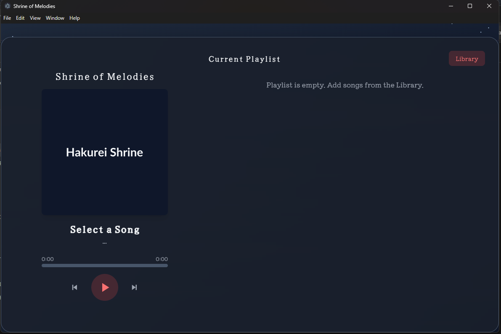

<div align="center">
<h1 align="center">RaikoMusics</h1>

<p align="center">
  <a href="https://opensource.org/licenses/MIT"></a>
  <a href="https://github.com/AntoineTorrezSuzano/RaikoMusics/blob/main/.github/workflows/main.yml"></a>
</p>
</div>

<h3 align="center">
RaikoMusics is a lightweight music streaming application designed for simplicity and speed. It provides an intuitive interface for users to listen to music and for artists to publish their work.

Primarily, RaikoMusics serves as a learning project to explore and implement various DevOps technologies. With the first stable version now online, the project provides a solid foundation for many future enhancements, such as upgrading the audio streaming from HTTP range requests to HLS (HTTP Live Streaming), implementing user management, adding playlist creation, developing a recommendation algorithm, and much more!

</h3>

## Screenshots

<div align="center">
  <p><em>Web Application:</em></p>
  
</div>

<br>

<div align="center">
  <p><em>Desktop Application:</em></p>
  
</div>

## Key Features

- **Self-Hosted Library**: Host and manage your personal music collection on your own server.
- **Simple Management**: An easy-to-use management page for uploading and organizing your music.
- **Web and Desktop Clients**: Access your music from a web browser or through a dedicated desktop application.
- **Containerized with Docker**: The entire application is packaged with Docker, making setup and deployment straightforward.
- **Automated CI/CD**: Includes a GitHub Actions workflow to automate the building and deployment process.

## Architecture Overview

RaikoMusics is composed of several distinct services that work together, all managed by `docker-compose`. This separation makes the system easier to maintain and scale.

- **`RaikoMusicsAPI`**: The central API, built with Node.js and Express, that handles core logic like file uploads and music metadata.
- **`AudioStreamServer`**: A simple and efficient Nginx server dedicated to streaming audio files to the clients.
- **`raikoMusicsWeb`**: A static web server that hosts the frontend for the web player and the management interface.
- **`raikomusics`**: The native desktop application built with Electron, which provides the same experience as the web client in a standalone app.

## Technology Stack

- **Backend API**: Node.js, Express
- **Web Server / Reverse Proxy**: Nginx (used as the main reverse proxy for the server and for serving audio files within the `AudioStreamServer` container)
- **Frontend**: HTML5, CSS3, JavaScript
- **Desktop App**: Electron
- **Containerization**: Docker, Docker Compose
- **CI/CD**: GitHub Actions

## Getting Started

To set up the RaikoMusics platform, you will need a server environment with Docker, Docker Compose, Nginx, and a few other standard tools installed. This guide was tested on a Rocky Linux 9 virtual machine, but any modern Linux distribution should be suitable.

### Prerequisites

Please ensure you have the following software installed on your server:

- [Git](https://git-scm.com/book/en/v2/Getting-Started-Installing-Git)
- [Docker](https://docs.docker.com/get-docker/)
- [Docker Compose](https://docs.docker.com/compose/install/)
- [Nginx](https://www.nginx.com/resources/wiki/start/topics/tutorials/install/)
- [npm](https://docs.npmjs.com/downloading-and-installing-node-js-and-npm)

---

## Installation and Execution

Follow these steps in order to get the platform running.

### 1\. Configure Nginx Reverse Proxy

Before launching the application, you must configure Nginx to correctly route requests to the different services running in Docker.

1.  **Create an Nginx configuration file:**

    Create a new file at `/etc/nginx/conf.d/raikomusics.conf` and paste the following content into it.

    ```nginx
    server {
        listen 80;
        server_name your_server_IP; # <-- Replace with your server's IP or domain

        # Route to the main web application
        location / {
            proxy_pass http://localhost:6777;
            proxy_set_header Host $host;
            proxy_set_header X-Real-IP $remote_addr;
            proxy_set_header X-Forwarded-For $proxy_add_x_forwarded_for;
            proxy_set_header X-Forwarded-Proto $scheme;
        }

        # Route to the audio streaming service
        location /musicstream/ {
            add_header 'Access-Control-Allow-Origin' '*';
            proxy_pass http://localhost:6888/;
            proxy_set_header Host $host;
            proxy_set_header X-Real-IP $remote_addr;
            proxy_set_header X-Forwarded-For $proxy_add_x_forwarded_for;
            proxy_set_header X-Forwarded-Proto $scheme;
        }

        # Route to the backend API
        location /api/ {
            client_max_body_size 50M;
            proxy_pass http://localhost:6999/;
            proxy_set_header Host $host;
            proxy_set_header X-Real-IP $remote_addr;
            proxy_set_header X-Forwarded-For $proxy_add_x_forwarded_for;
            proxy_set_header X-Forwarded-Proto $scheme;
        }
    }
    ```

2.  **Verify and reload Nginx:**

    Run the following commands to check for syntax errors and apply the new configuration.

    ```bash
    # Verify the configuration file for errors
    sudo nginx -t

    # Reload Nginx to apply the changes
    sudo systemctl reload nginx
    ```

### 2\. Clone and Launch the Application

1.  **Clone the repository:**

    ```bash
    git clone https://github.com/raikomusics/raikomusics.git
    cd raikomusics
    ```

2.  **Build and launch the services:**

    ```bash
    docker-compose up --build -d
    ```

    This command will build the Docker images for each service and start the containers in detached mode.

---

## Configuration (Crucial Step)

⚠️ **Important**: The project's frontend code contains hardcoded IP addresses from the original development environment (e.g., `https://35.79.6.219`). You **must** replace these with your server's IP address or domain name for the application to work correctly.

---

## Usage

Once the services are running and correctly configured, the platform will be accessible.

- **Web Application**: `http://your_server_IP`
- **API Base URL**: `http://your_server_IP/api`

### API Endpoints

Here are the available API endpoints:

#### Upload Music

- **Endpoint**: `POST /api/music/upload`
- **Description**: Uploads a new song, cover, and metadata.
- **Body**: `form-data`
  - `artist` (string): The name of the artist.
  - `title` (string): The title of the song.
  - `cover` (file): The album cover image. Accepted formats: `webp`, `png`, `jpg`. Max size: 50MB.
  - `song` (file): The audio file. Accepted format: `mp3`. Max size: 50MB.

#### Get Music List

- **Endpoint**: `GET /api/music/get/list`
- **Description**: Retrieves a JSON list of all available music. Each object in the list contains an `id`, `title`, and `artist`.

#### Delete Music

- **Endpoint**: `DELETE /api/music/delete/<id>`
- **Description**: Deletes a song from the server using its unique ID.
- **Example**: `/api/music/delete/12345`

### How File Streaming Works

When you upload a song via the `POST /api/music/upload` endpoint, the files are saved into a local Docker volume (`/var/www/music/`). This volume is shared with the `AudioStreamServer` container, which exposes its contents directly. This allows the frontend to access and stream the audio files from the following path: `http://your_server_IP/musicstream/`

---

## Deployment

The project includes a `deploy.sh` script to facilitate deployment to a production environment. This script, in conjunction with the GitHub Actions workflow, automates the process of pulling the latest Docker images and restarting the services.

## License

This project is licensed under the MIT License. See the [LICENSE](https://github.com/AntoineTorrezSuzano/RaikoMusics/blob/main/LICENSE) file for more details.
